<br><br><br><br><br><br><br>
<center>Solemne N°2</center>
<center>Tópicos de Especialidad en Informática II</center>

<br><br><br><br><br><br><br><br><br><br><br><br>
<center></center>
<center>Universidad Andrés Bello</center>
<center>Facultad de Ingeniería</center>
<center>Cristián Ormazábal</center>
<center>Santiago - 26 de mayo de 2021</center>
<center>Profesor Cristián Rojas Catalán</center>

<div style="page-break-after: always;"></div>

# Enunciado

## 1. Aplicación Angular
Crear una aplicación web utilizando Angular que tenga su nombre en el siguiente formato:
“nombreapellido”, ejemplo: “pedrosotoangular”, asignando como prefijo de los componentes las
iniciales de su nombre y apellido (para el ejemplo “ps”)

**IMPORTANTE:** Debe indicar todos los comandos ejecutados durante todo el desarrollo de la
prueba.

## 2. Modelo
Crear un modelo para mostrar información de los alumnos (usted decide los atributos que
utilizará, pero debe indicarlos y deben ser al menos 4) e incluir un servicio para ello (usted decide como mostrar los datos en angular), con un menú que permita llamar a esta funcionalidad.

## 3. Proyecto Laravel
Utilizar homestead con Laravel para crear un proyecto con su nombre en el siguiente formato:
“nombreapellido”, ejemplo: “pedrosotolaravel”

## 4. Tablas
Crear la tabla con Eloquent y Artisan que permita completar la tabla con datos demo
directamente con Seeder a través de una migración.

## 5. Conectarse a la BD
Conectarse a la base de datos y obtener acceso a los datos desde Angular utilizando la API Rest
de Laravel (probar eso con Postman e incluir la captura).

## 6. Desplegar la información
Mostrar el resultado en Angular, mostrando la información de los alumnos desde la base de datos
utilizando el botón del menú.

Al terminar debe subir el proyecto Angular, la copia de los archivos de Laravel en Windows
incluyendo el archivo Homestead.yaml, exportar la base de datos utilizando MySQL Workbench, a
Google Drive y compartirlo con el correo cristiane.rojas@uandresbello.edu indicando los comandos utilizados y capturas de pantalla de ambos proyectos funcionando.

# Desarrollo

## 1. Aplicación Angular
Crear una aplicación web utilizando Angular que tenga su nombre en el siguiente formato:
“nombreapellido”, ejemplo: “pedrosotoangular”, asignando como prefijo de los componentes las
iniciales de su nombre y apellido (para el ejemplo “ps”)

**IMPORTANTE:** Debe indicar todos los comandos ejecutados durante todo el desarrollo de la
prueba.

Crearemos aplicación angular con los siguientes parámetros:

-nombre: cristianormazabalangular

-prefijo: co

Primero establecemos directorio base:

/home/cristian/Education/Unab/2021/Trimestre 1/Topicos de Especialidad en Informática II/Solemne N°2

Crear aplicación:
```
ng new cristianormazabalangular --prefix co
```

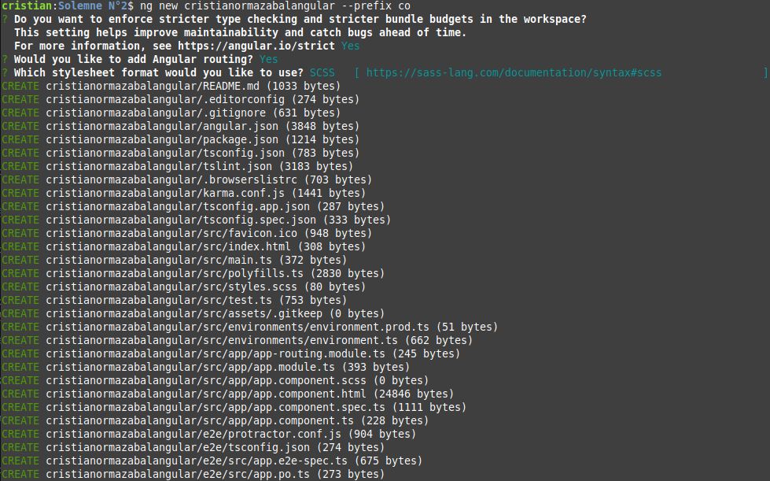

En el ambiente de desarrollo está fallando el comando npm. Como alternativa utilizaremos yarn.

Agregaremos bootstrap:
```
yarn add bootstrap @popperjs/core
```
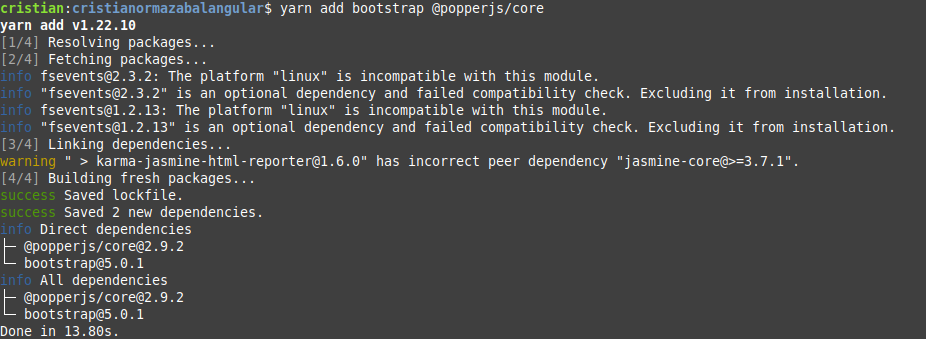


Vamos a cargar el módulo bootstrap en nuestro scss en el archivo src/styles.scss:

```
@import "node_modules/bootstrap/scss/bootstrap";
```

Servimos la aplicación:

```
ng serve
```

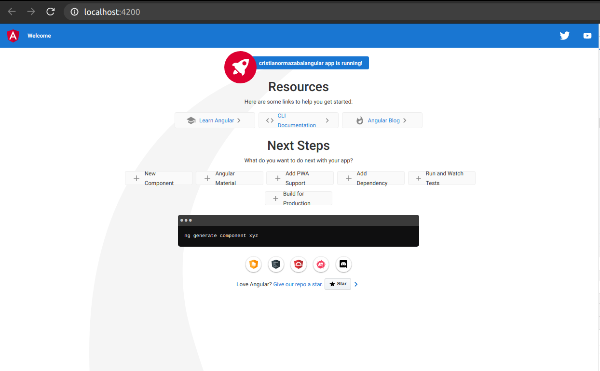


Aprovechamos de verificar que carga la versión actual de bootstrap:

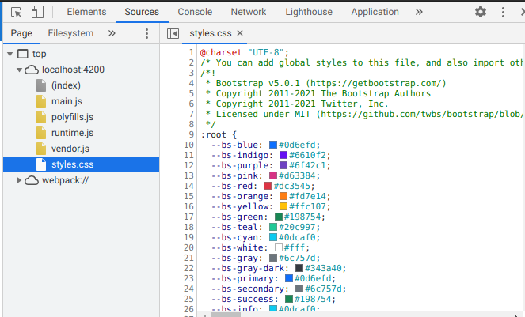

Es la versión 5.0.1, actual.

Agregaremos barra de navegación.

```
ng g c navbar -is --flat
```

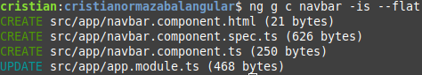

Actualizamos src/app.component.html para incluir el navbar:

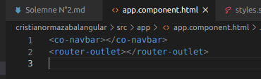

En main.ts debemos importar bootstrap para que cargue las funciones del módulo:

```
import 'bootstrap';
```

En src/navbar.html declararemos las rutas necesarias para esta aplicación:

```html
<nav class="navbar navbar-expand-sm navbar-light bg-light">
  <div class="container-fluid">
    <a class="navbar-brand" [routerLink]="['/']">Curso</a>
    <button class="navbar-toggler" type="button" data-bs-toggle="collapse" data-bs-target="#navbarSupportedContent" aria-controls="navbarSupportedContent" aria-expanded="false" aria-label="Toggle navigation">
      <span class="navbar-toggler-icon"></span>
    </button>
    <div class="collapse navbar-collapse" id="navbarSupportedContent">
      <ul class="navbar-nav me-auto mb-2 mb-lg-0">
        <li class="nav-item" routerLinkActive="active">
          <a class="nav-link active" aria-current="page" [routerLink]="['/']">Inicio</a>
        </li>
        <li class="nav-item" routerLinkActive="active">
          <a class="nav-link" [routerLink]="['/alumnos']">Alumnos</a>
        </li>
        <li class="nav-item" routerLinkActive="active">
          <a class="nav-link" [routerLink]="['/acercade']">Acerca de</a>
        </li>
      </ul>
    </div>
  </div>
</nav>
```

Tendremos las siguientes rutas:
- / para inicio
- alumnos para desplegar la información de alumnos obtenida desde la base de datos con un servicio.
- acercade para mostrar información sobre este desarrollo.

Vamos a crear los componentes para las rutas.

* inicio

```
ng g c inicio
```

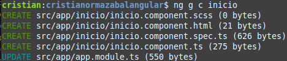

Vamos a asignar contenido:

```html
<div class="container">
  <div class="row">
    <div class="col">
      <div class="card">
        <div class="card-header">
          Solemne N°2
        </div>
        <div class="card-body">
          <h5 class="card-title">Prueba con Angular, Laravel, Homestead y mySql.</h5>
          <p class="card-text">Tópicos de especialidad en informática II</p>
        </div>
      </div>
    </div>
  </div>
</div>
```

* alumnos

```
ng g c alumnos
```

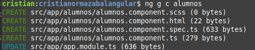

El contenido de alumnos lo vamos a dejar para más adelante, cuando definamos el modelo y el servicio para obtener los datos.

* acercade

```
ng g c acercade
```

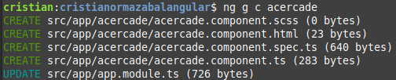


Contenido:

```html
<div class="container">
  <div class="row">
    <div class="col">
      <div class="card">
        <div class="card-header">
          Solemne N°2 - Cristián Ormazábal
        </div>
        <div class="card-body">
          <h5 class="card-title">Prueba con Angular, Laravel, Homestead y mySql.</h5>
          <p class="card-text">Tópicos de especialidad en informática II</p>
        </div>
      </div>
    </div>
  </div>
</div>
```

Luego debemos registrar las rutas en app.module.ts:

```ts
import { AppRoutingModule, routes } from './app-routing.module';
```

y en el arreglo imports de @NgModule:
```ts
imports: [
    routes,
    BrowserModule,
    AppRoutingModule
  ],
```

Además, en app-routing.module.ts debemos registrar las rutas y exportarlas:

```ts
import { ModuleWithProviders, NgModule } from '@angular/core';
import { RouterModule, Routes } from '@angular/router';
import { InicioComponent } from './inicio/inicio.component';
import { AlumnosComponent } from './alumnos/alumnos.component';
import { AcercadeComponent } from './acercade/acercade.component';

const appRoutes: Routes = [
  { path: '', redirectTo: '/inicio', pathMatch: 'full' },
  { path: 'inicio', component: InicioComponent, },
  { path: 'alumnos', component: AlumnosComponent, },
  { path: 'acercade', component: AcercadeComponent, },
];

@NgModule({
  imports: [RouterModule.forRoot(appRoutes)],
  exports: [RouterModule]
})
export class AppRoutingModule { }
export const routes: ModuleWithProviders<RouterModule> = RouterModule.forRoot(appRoutes);
```

## 2. Modelo
Crear un modelo para mostrar información de los alumnos (usted decide los atributos que
utilizará, pero debe indicarlos y deben ser al menos 4) e incluir un servicio para ello (usted decide como mostrar los datos en angular), con un menú que permita llamar a esta funcionalidad.

Creación de modelo:

```bash
mkdir src/app/modelo
cd src/app/modelo
ng g class alumno --skit-tests
```

Vamos a definir el contenido de la clase Alumno:

```ts
export class Alumno {
  constructor(
    public id: string,
    public nombre: string,
    public descripcion: string,
    public anoIngreso: number,
    public fechaNacimiento: Date,
    public miniatura: string,
  ) {}
}

```

Vamos a crear un servicio que obtiene alumnos al que llamaremos AlumnosService:

```bash
mkdir src/app/servicios
pushd src/app/servicios
ng g s alumnos --skip-tests
popd
```

```ts
import { HttpClient } from '@angular/common/http';
import { Injectable } from '@angular/core';
import { Alumno } from '../modelo/alumno';
import { Observable } from 'rxjs';

@Injectable({
  providedIn: 'root'
})
export class AlumnosService {
  alumnos: Alumno[] = [
    {
      id: '1', nombre: 'Imagen web', descripcion: 'imagen de ejemplo', miniatura: 'https://images.unsplash.com/photo-1563874257547-d19fbb71b46c?ixid=MnwxMjA3fDB8MHxzZWFyY2h8Mnx8dGh1bWJuYWlsfGVufDB8fDB8fA%3D%3D&ixlib=rb-1.2.1&auto=format&fit=crop&w=500&q=60',
      anoIngreso: 2020, fechaNacimiento: new Date() },
    {
      id: '2', nombre: 'Imagen web 2', descripcion: 'imagen de ejemplo', miniatura: 'https://images.unsplash.com/photo-1614178082459-8d801006f86f?ixid=MnwxMjA3fDB8MHxzZWFyY2h8M3x8dGh1bWJuYWlsfGVufDB8fDB8fA%3D%3D&ixlib=rb-1.2.1&auto=format&fit=crop&w=500&q=60',
      anoIngreso: 2020, fechaNacimiento: new Date() },
    {
      id: '3', nombre: 'Imagen web 3', descripcion: 'imagen de ejemplo', miniatura: 'https://images.unsplash.com/photo-1611223426643-fa293cb2efbc?ixid=MnwxMjA3fDB8MHxzZWFyY2h8N3x8dGh1bWJuYWlsfGVufDB8fDB8fA%3D%3D&ixlib=rb-1.2.1&auto=format&fit=crop&w=500&q=60',
      anoIngreso: 2020, fechaNacimiento: new Date() },
    {
      id: '4', nombre: 'Imagen web 4', descripcion: 'imagen de ejemplo', miniatura: 'https://images.unsplash.com/photo-1521566652839-697aa473761a?ixid=MnwxMjA3fDB8MHxzZWFyY2h8MTF8fHRodW1ibmFpbHxlbnwwfHwwfHw%3D&ixlib=rb-1.2.1&auto=format&fit=crop&w=500&q=60',
      anoIngreso: 2020, fechaNacimiento: new Date() },
    {
      id: '5', nombre: 'Imagen web 5', descripcion: 'imagen de ejemplo', miniatura: 'https://images.unsplash.com/photo-1543249098-142376d7f72b?ixid=MnwxMjA3fDB8MHxzZWFyY2h8MTN8fHRodW1ibmFpbHxlbnwwfHwwfHw%3D&ixlib=rb-1.2.1&auto=format&fit=crop&w=500&q=60',
      anoIngreso: 2020, fechaNacimiento: new Date() },
    {
      id: '6', nombre: 'Imagen web 6', descripcion: 'imagen de ejemplo', miniatura: 'https://images.unsplash.com/photo-1510272206246-9c2faaf4b4b6?ixid=MnwxMjA3fDB8MHxzZWFyY2h8MjF8fHRodW1ibmFpbHxlbnwwfHwwfHw%3D&ixlib=rb-1.2.1&auto=format&fit=crop&w=500&q=60',
      anoIngreso: 2020, fechaNacimiento: new Date() },
    {
      id: '7', nombre: 'Imagen web 7', descripcion: 'imagen de ejemplo', miniatura: 'https://images.unsplash.com/photo-1553830591-42e4fd7035ec?ixid=MnwxMjA3fDB8MHxzZWFyY2h8MjZ8fHRodW1ibmFpbHxlbnwwfHwwfHw%3D&ixlib=rb-1.2.1&auto=format&fit=crop&w=500&q=60',
      anoIngreso: 2020, fechaNacimiento: new Date() },
    {
      id: '8', nombre: 'Imagen web 8', descripcion: 'imagen de ejemplo', miniatura: 'https://images.unsplash.com/photo-1586765677067-f8030bd8e303?ixid=MnwxMjA3fDB8MHxzZWFyY2h8MzF8fHRodW1ibmFpbHxlbnwwfHwwfHw%3D&ixlib=rb-1.2.1&auto=format&fit=crop&w=500&q=60',
      anoIngreso: 2020, fechaNacimiento: new Date() }
  ]

  constructor(private http :HttpClient){
  }

  // getAlumnos(): Observable<Alumno[]>{
  //   return this.http.get<Alumno[]>('http://cristianormazaballaravel.test/api/v1/alumnos');
  // }
  getAlumnos() {
    return this.alumnos;
  }
}

```

Nota. Por ahora dejaremos comentado la llamada a Laravel y con datos ficticios.

Hay que agregar la instanciación el servicio al app module:

```ts
import { AlumnosService } from './servicios/alumnos.service';

@NgModule({
...
  providers: [AlumnosService],
  bootstrap: [AppComponent]
...
```

Ahora vamos a implementar el componente de la ruta alumnos para mostrar la información de alumnos obtenida desde el servicio AlumnosService.

En el componente de alumnos agregaremos la carga de alumnos:

```ts
import { Component, OnInit } from '@angular/core';
import { Observable } from 'rxjs';
import { Alumno } from '../modelo/alumno';
import { AlumnosService } from '../servicios/alumnos.service';

@Component({
  selector: 'co-alumnos',
  templateUrl: './alumnos.component.html',
  styleUrls: ['./alumnos.component.scss']
})
export class AlumnosComponent implements OnInit {
  //alumnos: Observable<Alumno[]>;
  alumnos: Alumno[];
  constructor(
    private alumnosService: AlumnosService,
  ) { 
    this.alumnos = alumnosService.getAlumnos();
  }

  ngOnInit(): void {
  }

}

```

Por ahora dejaremos comentada la linea con la definición de Observable hasta que tengamos el servicio llamando a Laravel.

El contenido del componente alumnos:

```html
<div class="container">
  <div class="row row-cols-sm-4 row-cols-md-5">
    <div class="col" *ngFor="let alumno of alumnos">
      <co-alumno [alumno]="alumno"></co-alumno>
    </div>
  </div>
</div>
```

Ahora debemos crear el componente alumno:

```bash
pushd src/app/alumnos
ng g c alumno -s --skip-tests --flat
popd
```

```ts
import { Component, Input, OnInit } from '@angular/core';
import { Alumno } from '../modelo/alumno';

@Component({
  selector: 'co-alumno',
  templateUrl: './alumno.component.html',
  styles: [
  ]
})
export class AlumnoComponent implements OnInit {
  @Input() alumno!: Alumno;
  constructor() { }

  ngOnInit(): void {
  }

}

```

```html
<div class="card" style="width: 18rem;">
  
  <div class="card-body">
    <h5 class="card-title">{{alumno.nombre | uppercase}}</h5>
    <p class="card-text">{{alumno.descripcion}}</p>
  </div>
  <ul class="list-group list-group-flush">
    <li class="list-group-item">Año: {{alumno.anoIngreso}}</li>
    <li class="list-group-item">Fecha nac: {{alumno.fechaNacimiento | date:'shortDate'}}</li>
  </ul>
</div>
```

## 3. Proyecto Laravel
Utilizar homestead con Laravel para crear un proyecto con su nombre en el siguiente formato:
“nombreapellido”, ejemplo: “pedrosotolaravel”

Crearemos un proyecto llamado cristianormazaballaravel.

```bash
cd Homestead
vagrant up
vagrant ssh
composer create-project laravel/laravel cristianormazaballaravel
```

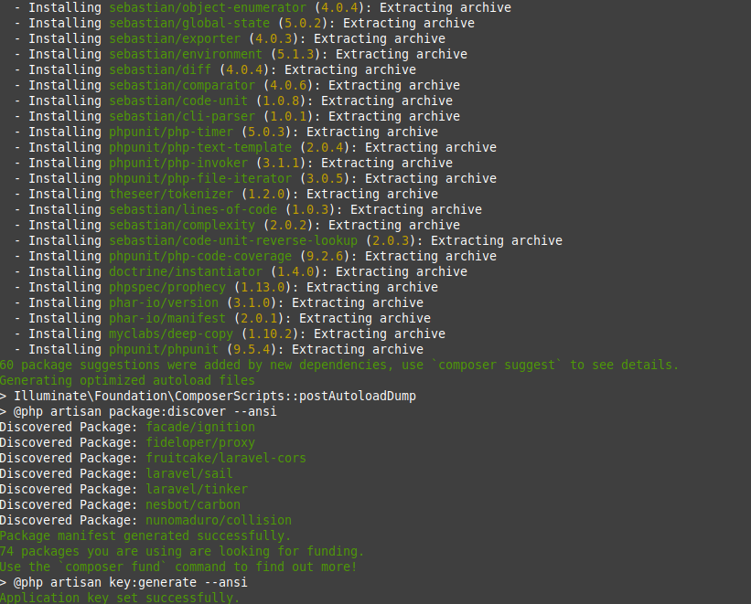

```bash
cd cristianormazaballaravel
ls -l
```

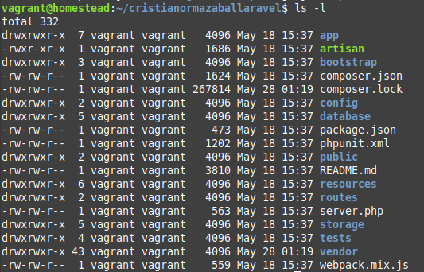


Agregamos la entrada a /etc/hosts:

```bash
192.168.10.10   cristianormazaballaravel.test
```

Y probamos:

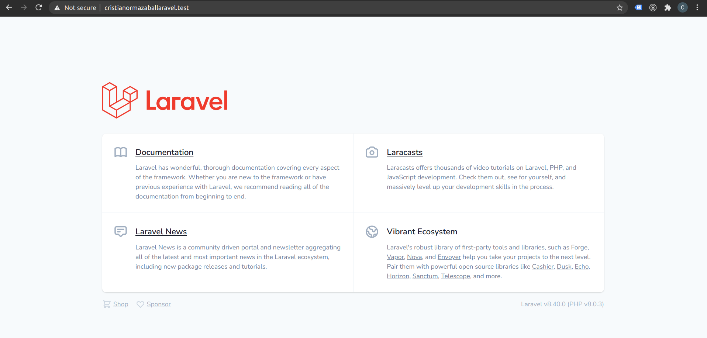

Y el archivo Homestead.yaml:

```yaml
---
ip: "192.168.10.10"
memory: 2048
cpus: 2
provider: virtualbox

authorize: ~/.ssh/id_rsa.pub

keys:
    - ~/.ssh/id_rsa

folders:
    - map: ~/code
      to: /home/vagrant/code

sites:
    - map: homestead.test
      to: /home/vagrant/primerproyectolaravel/public
    - map: cristianormazaballaravel.test
      to: /home/vagrant/cristianormazaballaravel/public

databases:
    - homestead

features:
    - mysql: true
    - mariadb: false
    - postgresql: false
    - ohmyzsh: false
    - webdriver: false

```

## 4. Tablas
Crear la tabla con Eloquent y Artisan que permita completar la tabla con datos demo
directamente con Seeder a través de una migración.


Creación de base de datos

Ejecutar
```bash
mysql -u homestead -p
```

Creamos base de datos **cristianormazabalmysql**:

```mysql
CREATE DATABASE cristianormazabalmysql;
```

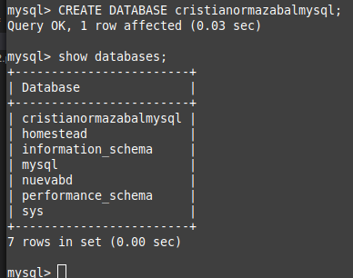

Ingresamos a la maquina al proyecto y dejamos guardados saliendo una vez que asignamos el valor de DB_DATABASE=cristianormazabalmysql y DB_PASSWORD=secret

```bash
cd cristianormazaballaravel
vi .env
```

Y el contenido:
```bash
APP_NAME=Laravel
APP_ENV=local
APP_KEY=base64:QErWHSv5jBj3kbeBJnyLvZ0seOnf3kMY/TBh45KN6Fw=
APP_DEBUG=true
APP_URL=http://localhost

LOG_CHANNEL=stack
LOG_LEVEL=debug

DB_CONNECTION=mysql
DB_HOST=127.0.0.1
DB_PORT=3306
DB_DATABASE=cristianormazabalmysql
DB_USERNAME=root
DB_PASSWORD=secret

BROADCAST_DRIVER=log
CACHE_DRIVER=file
QUEUE_CONNECTION=sync
SESSION_DRIVER=file
SESSION_LIFETIME=120

MEMCACHED_HOST=127.0.0.1

REDIS_HOST=127.0.0.1
REDIS_PASSWORD=null
REDIS_PORT=6379

MAIL_MAILER=smtp
MAIL_HOST=mailhog
MAIL_PORT=1025
MAIL_USERNAME=null
MAIL_PASSWORD=null
MAIL_ENCRYPTION=null
MAIL_FROM_ADDRESS=null
MAIL_FROM_NAME="${APP_NAME}"

AWS_ACCESS_KEY_ID=
AWS_SECRET_ACCESS_KEY=

```


Creamos el modelo

```bash
php artisan make:model alumnos -m
```

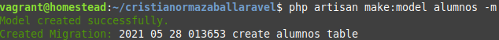

Editamos la creación del modelo:

```bash
vi database/migrations/2021_05_28_013653_create_alumnos_table.php
```

```php
<?php

use Illuminate\Database\Migrations\Migration;
use Illuminate\Database\Schema\Blueprint;
use Illuminate\Support\Facades\Schema;

class CreateAlumnosTable extends Migration
{
    /**
     * Run the migrations.
     *
     * @return void
     */
    public function up()
    {
        Schema::create('alumnos', function (Blueprint $table) {
            $table->id();
            $table->string('nombre', 255);
            $table->text('descripcion')->nullable();
            $table->string('miniatura')->nullable();
            $table->integer('anoingreso');
            $table->datetime('fechanacimiento');
            $table->timestamps();
        });
    }

    /**
     * Reverse the migrations.
     *
     * @return void
     */
    public function down()
    {
        Schema::dropIfExists('alumnos');
    }
}

```

Ejecutamos la migración:
```bash
php artisan migrate
```

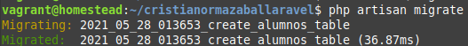

Y la tabla

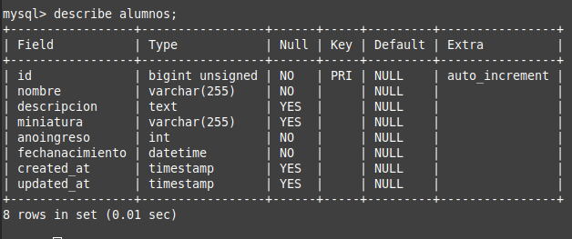


```bash
 vi app/Models/alumnos.php
```

```php
<?php

namespace App\Models;

use Illuminate\Database\Eloquent\Factories\HasFactory;
use Illuminate\Database\Eloquent\Model;

class alumnos extends Model
{
    use HasFactory;
    protected $fillable = [
            'nombre', 'descripcion', 'miniatura', 'anoingreso', 'fechanacimiento'
    ];
}

```

Seeder

```bash
php artisan make:seeder alumnosTableSeeder
vi database/seeders/alumnosTableSeeder.php
```

```php
<?php

namespace Database\Seeders;

use Illuminate\Database\Seeder;

use App\Models\alumnos;
use Faker\Factory as Faker;

class alumnosTableSeeder extends Seeder
{
    /**
     * Run the database seeds.
     *
     * @return void
     */
    public function run()
    {
            $faker = Faker::create();
            $miniaturas = array(
                    "miniatura1",
                    "miniatura2",
                    "miniatura3",
                    "miniatura4",
                    "miniatura5",
                    "miniatura6",
                    "miniatura7",
                    "miniatura8",
                    "miniatura9",
                    "miniatura10"
           );
           foreach ($miniaturas as $miniatura)
           {
                   alumnos::create([
                           'nombre' => $faker->text(80),
                           'descripcion' => $content = $faker->paragraph(18),
                           'miniatura' => $miniatura."_MINI.jpg",
                           'anoingreso' => 2020,
                           'fechanacimiento' => $faker->date()
                   ]);
           }
    }
}

```

```bash
vi database/seeders/DatabaseSeeder.php
```

```php
<?php

namespace Database\Seeders;

use Illuminate\Database\Seeder;

class DatabaseSeeder extends Seeder
{
    /**
     * Seed the application's database.
     *
     * @return void
     */
    public function run()
    {
        $this->call(alumnosTableSeeder::class);
    }
}

```

```bash
php artisan db:seed
```

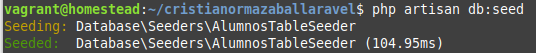


## 5. Conectarse a la BD
Conectarse a la base de datos y obtener acceso a los datos desde Angular utilizando la API Rest
de Laravel (probar eso con Postman e incluir la captura).

Editar archivo de rutas

```bash
vi routes/api.php
```

```php
<?php

use Illuminate\Http\Request;
use Illuminate\Support\Facades\Route;

/*
|--------------------------------------------------------------------------
| API Routes
|--------------------------------------------------------------------------
|
| Here is where you can register API routes for your application. These
| routes are loaded by the RouteServiceProvider within a group which
| is assigned the "api" middleware group. Enjoy building your API!
|
*/

Route::middleware('auth:api')->get('/user', function (Request $request) {
    return $request->user();
});

Route::group(['prefix' => 'v1', 'middleware' => 'cors'], function(){
        Route::resource('alumnos', 'App\Http\Controllers\AlumnosController');
});

```

Crear controlador
```bash
php artisan make:controller AlumnosController --resource
```

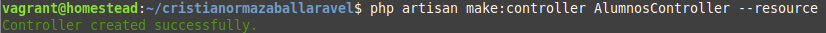

Verificamos las rutas

```bash
php artisan route:list
```

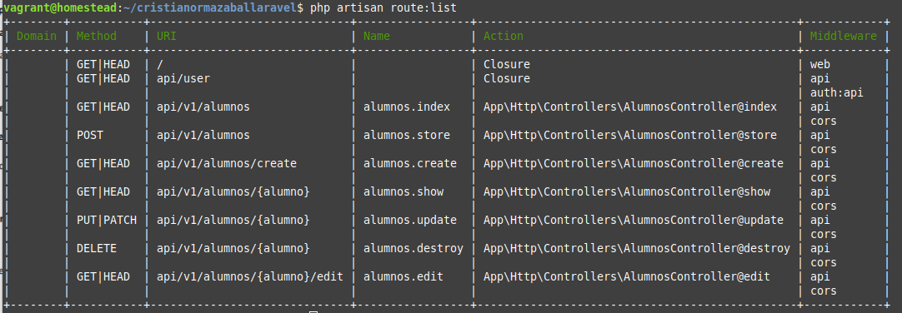


Editamos el controlador

```bash
vi app/Http/Controllers/AlumnosController.php
```

```php
?php

namespace App\Http\Controllers;

use Illuminate\Http\Request;
use App\Models\alumnos;
use Illuminate\Support\Facades\Response;

class AlumnosController extends Controller
{
    /**
     * Display a listing of the resource.
     *
     * @return \Illuminate\Http\Response
     */
    public function index()
    {
            $alumnos = alumnos::all();
            $response = Response::json($alumnos, 200);
            return $response;
    }
    /**
     * Show the form for creating a new resource.
     *
     * @return \Illuminate\Http\Response
     */
    public function create()
    {
    }
/**
     * Store a newly created resource in storage.
     *
     * @param  \Illuminate\Http\Request  $request
     * @return \Illuminate\Http\Response
     */
    public function store(Request $request)
    {
    }
    /**
     * Display the specified resource.
     *
     * @param  int  $id
     * @return \Illuminate\Http\Response
     */
    public function show($id)
    {
    }
    /**
     * Show the form for editing the specified resource.
     *
     * @param  int  $id
     * @return \Illuminate\Http\Response
     */
    public function edit($id)
    {
    }
 /**
     * Update the specified resource in storage.
     *
     * @param  \Illuminate\Http\Request  $request
     * @param  int  $id
     * @return \Illuminate\Http\Response
     */
    public function update(Request $request, $id)
    {
    }
 /**
     * Remove the specified resource from storage.
     *
     * @param  int  $id
     * @return \Illuminate\Http\Response
     */
    public function destroy($id)
    {
    }
}

```

Vamos a agregar Cors:

```bash
php artisan make:middleware Cors
```

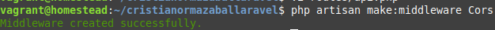


```bash
vi app/Http/Middleware/Cors.php
```

```php
<?php

namespace App\Http\Middleware;

use Closure;
use Illuminate\Http\Request;

class Cors
{
    /**
     * Handle an incoming request.
     *
     * @param  \Illuminate\Http\Request  $request
     * @param  \Closure  $next
     * @return mixed
     */
    public function handle(Request $request, Closure $next)
    {
            return $next($request)->header('Access-Control-Allow-Origin','*')
                    ->header('Access-Control-Allow-Methods', 'GET, POST, PUT, DELETE, OPTIONS');
    }
}

```

```bash
vi app/Http/Kernel.php
```
y se agrega la línea:

```php
'cors' => \App\Http\Middleware\Cors::class,
```

Si probamos en el navegador la api yendo a http://cristianormazaballaravel.test/api/v1/alumnos

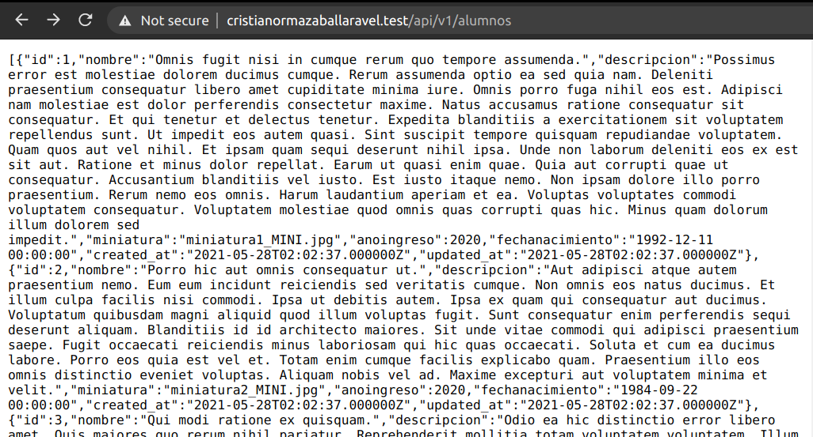

Vamos a probar con postman:

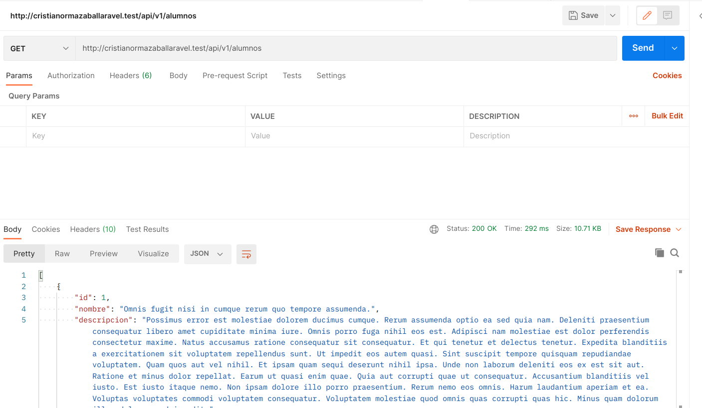

## 6. Desplegar la información
Mostrar el resultado en Angular, mostrando la información de los alumnos desde la base de datos
utilizando el botón del menú.

Vamos a modificar los archivos que dejamos pendientes ahora que está implementada la API Laravel.

Editamos src/app/servicios/alumnos.service.ts

Ahora, al navegar:

http://localhost:4200


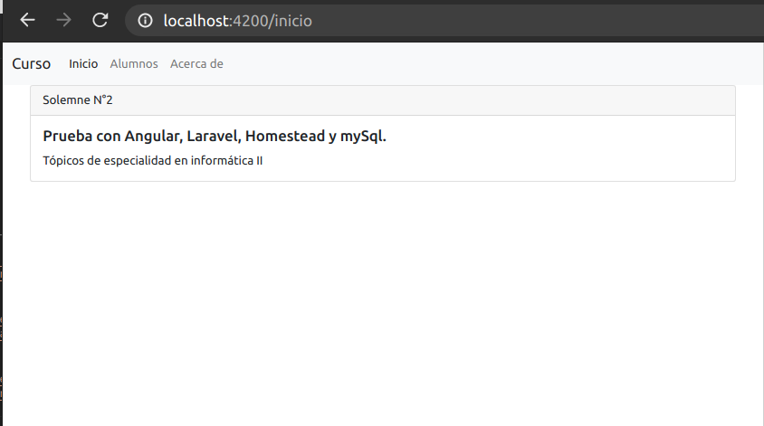

El menú tiene la ruta Alumnos, que al seleccionar, despliega los alumnos:


Al revisar el inspector de red, vemos la llamada a Laravel:

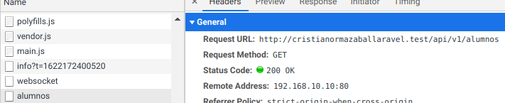

Y el contenido

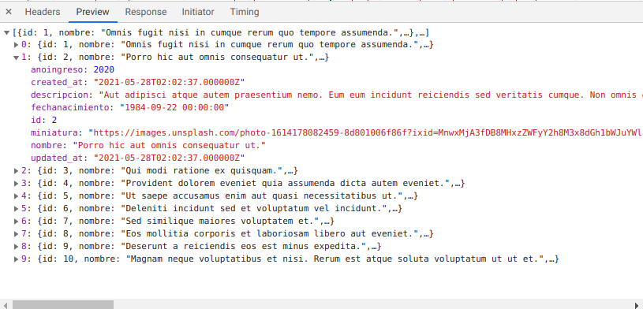


Al terminar debe subir el proyecto Angular, la copia de los archivos de Laravel en Windows
incluyendo el archivo Homestead.yaml, exportar la base de datos utilizando MySQL Workbench, a
Google Drive y compartirlo con el correo cristiane.rojas@uandresbello.edu indicando los comandos utilizados y capturas de pantalla de ambos proyectos funcionando.

Se incluyen los archivos:

- cristianormazabalmysql.sql - mysqldump
- cristianormazaballaravel - proyecto laravel
- Homestead.yaml - archivo de configuración de Homestead
- Solemne N°2.md - este archivo
- Solemne N°2.pdf - este archivo renderizado como pdf
- img - directorio con imágenes de este proyecto.
- cristianormazabalangular - directorio con el proyecto de la aplicación angular.
